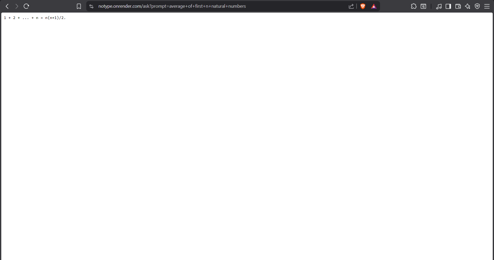

<div align="center">

# 🖥️ **NoTYPE — Zero-UI AI via URL**


<br>
<br>

🔗 <strong>Live Demo: http://notype.onrender.com </strong>
<br>

### ⚡ *A lightweight Node.js API that delivers AI responses directly through URL parameters.*

</div>

<p align="center">

<a href="https://github.com/akshitsharma-git/notype/stargazers">
  
</a>

<a href="https://github.com/akshitsharma-git/notype">
  
</a>

<a href="https://github.com/akshitsharma-git/notype/commits">
  
</a>

<br>


</p>

---

# 📌 **Overview**

NoTYPE is a **zero-UI AI API** where the **URL itself acts as the prompt**.

There are no input fields, no frontend, and no typing.  
You simply pass a query through the URL and receive an AI-generated response instantly.

The project explores **minimal interaction design** and **API-first AI usage**.

---

# ✨ **Features**

- 🚫 **No UI, no forms, no typing**
- 🔗 **Prompt passed directly via URL**
- ⚡ **Instant AI-generated responses**
- 🧠 **API-first architecture**
- 🚀 **Lightweight and fast**
- 🌐 **Deployed on Render**

---

# 📸 **Demo Preview**



---

# 🧪 **Usage**

### Example Endpoint
```text
http://notype.onrender.com/ask?prompt=your+question
```

---

# 🔍**How It Works**
1. User sends a prompt via URL query parameter  
2. Server processes the prompt  
3. AI-generated response is returned instantly  

---

# 🛠 **Tech Stack**

| Layer | Technology |
|------|------------|
| **Backend** | Node.js, Express.js |
| **AI** | Groq LLM |
| **Deployment** | Render |
| **Version Control** | Git + GitHub |

---

# 📁 **Project Structure**

```bash
notype/
│
├── public
│  └── assets/
├── server.js
├── routes/
├── controllers/
├── package.json
└── .env
```
---

# ⚙️ **Environment Variables**

Create a `.env` file in the root directory:

```bash
GROQ_API=your_api_key
PORT=your_port_number
```
---


# 💻 Local Development Setup
```bash
git clone https://github.com/akshitsharma-git/notype.git
cd notype
npm install
npm start
```
---

# 🧠 **Philosophy**

> Less interface. More intent.

NoTYPE removes friction by eliminating the UI entirely and focusing purely on **input → output**.

---

# 📜 **License**

This project is licensed under the **MIT License**.

---

<div align="center">
  <strong>If you find this idea interesting, consider giving it a star ⭐</strong>
</div>

<br>
<p align="center">Made with ❤️ by Akshit Sharma</p>
